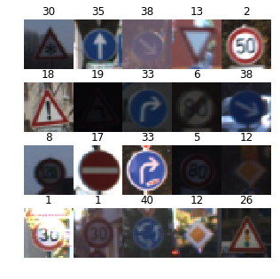
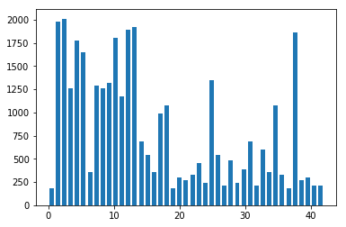
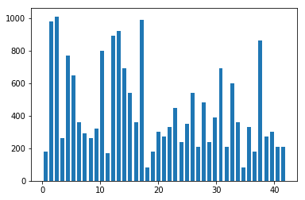
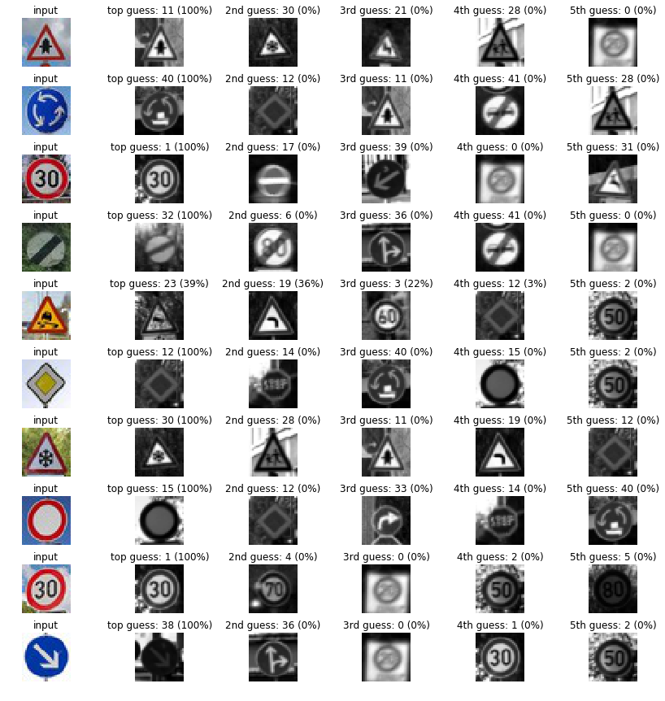

**Build a Traffic Sign Recognition Project**

The goals / steps of this project are the following:
* Load the data set (see below for links to the project data set)
* Explore, summarize and visualize the data set
* Design, train and test a model architecture
* Use the model to make predictions on new images
* Analyze the softmax probabilities of the new images
* Summarize the results with a written report

[//]: # (Image References)

[image2]: ./ref/grayscale.jpg "Grayscaling"
[image3]: ./ref/random_noise.jpg "Random Noise"
[image4]: ./ref/placeholder.png "Traffic Sign 1"
[image5]: ./ref/placeholder.png "Traffic Sign 2"
[image6]: ./ref/placeholder.png "Traffic Sign 3"
[image7]: ./ref/placeholder.png "Traffic Sign 4"
[image8]: ./ref/placeholder.png "Traffic Sign 5"

### Data Set Summary & Exploration

#### 1. Basic summary of the data set.

I used the basic `<len>` and `<.shape>` command to calculate summary statistics of the traffic
signs data set:

* The size of training set is **34799**
* The size of the validation set is **4410**
* The size of test set is **12630**
* The shape of a traffic sign image is **32 x 32 x 3**
* The number of unique classes/labels in the data set is **43**

#### 2. Exploratory visualization of the dataset.

Here is an exploratory visualization of the data set. The firt image is the view of some random images in the datasets.

Then the bar chart showing how the data was distributed, as we can see, there're too many samples(>1000) in some class meanwhile some class has less(<500) samples.

### Model Architecture

#### 1. Data Pre-process.

As a first step, I decided to remove some images, since there is too much dupulicate image for each class. I choose a threshold at 1000 images, since I think the same picture may leads to a bad result.

Number of samples in each class:  
 [ 180 1980 2010 1260 1770 1650  360 1290 1260 1320 1800 1170 1890 1920  690
  540  360  990 1080  180  300  270  330  450  240 1350  540  210  480  240
  390  690  210  599  360 1080  330  180 1860  270  300  210  210]
  

Then I convert the images to grayscale because it has less image depth, it may help for keep the image information meanwhile shorten the time consumption in building neural network. 

As a last step, I normalized the image data because the original image has different contrast due to the frame was take under various daylight envioment, which is really bad for a high quality nueral network construction. At first, I try to simulate the trick taken in *Multi-Column Deep Neural Network for Traffic Sign
Classification*, which contains:

* Image Adjustment (Imadjust) MATLAB
* Histogram Equalization (Histeq) MATLAB
* Adaptive Histogram Equalization
* Contrast Normalization (Conorm)

For the above technique, most of them were come from MATLAB, and I try to simulate the same function in python(I do quite a lot search ) however I failed. I know the main purpose is trying to take the sample image more clear or dark picture lighter. Above all, I move back to the basic normalize process.

Then I made a `<shuffle>` in sklearn package to the dataset since the images in same class seems locate in very close position.

#### 2. Model architecture 

My final model is basicaly the LeNet architecture, except it has a 43 classes output. 

It consisted of the following layers:

| Layer         		|     Description	        					| 
|:---------------------:|:---------------------------------------------:| 
| Input         		| 32x32x1 Greyscale image   					| 
| Convolution 3x3     	| 1x1 stride, same padding, outputs 28x28x6 	|
| RELU					| Activation			     					|
| Max pooling	      	| 2x2 stride,  outputs 14x14x6               	|
| Convolution 3x3	    | 1x1 stride, same padding, outputs 10x10x16  	|
| RELU					| Activation			     					|
| Max pooling	      	| 2x2 stride,  outputs 5x5x16               	|
| Flattern   	      	| outputs 400                                	|
| Fully connected		| outputs 120  									|
| RELU					| Activation			     					|
| Fully connected		| outputs 84  									|
| RELU					| keep_prob = 0.5			     				|
| Fully connected		| outputs 43 									|

#### 3. Training.
To train the model, I used belowing parameters:

* Optimizer = cross entropy
* Batch size = 100, 128, 256, 512, 1024
* Number of epochs = 10, 20, 30, 50, 100 
* Learning rate = 0.1, 0.01, 0.001, 0.0001, 0.0005, 0.0007, 0.00045

#### 4. Model Solution

My final model results were:
* training set accuracy of **0.996**
* validation set accuracy of **0.983** 
* test set accuracy of **0.871**

If a well known architecture was chosen:
* What architecture was chosen? 
**LeNet-5**
* Why did you believe it would be relevant to the traffic sign application? 
**Both Traffic sign and number in grayscale is a single image matrix**
* How does the final model's accuracy on the training, validation and test set provide evidence that the model is working well?
**Validation accuracy higher than 98%**
 

### Test a Model on New Images

#### 1. German traffic signs found on the web.
Here are 10 German traffic signs that I found on the web:

        

The 1st image might be difficult to classify because it was dominated by large black pixels in the main white background area.

The 2nd image might be difficult to classify because the number '3' looks very similar to number '8'.

The 3rd image might be difficult to classify because it was a very old and dirty traffic sign also it doesn't looks same as the latest german traffic strandard.

The 4th image might be difficult to classify because it's a slippery road sign however it's not a German road sign.

The 5th image might be difficult to classify because it has a perspective angle.

The 6th image might be difficult to classify because it was dominated by large black pixels in the main white background area.

The 7th image might be difficult to classify because it has a perspective angle.

The 8th image might be difficult to classify because the number '3' looks very similar to number '8'.

The 10th image might be difficult to classify because the arrow in it may have different rotation angle compare to training data.

#### 2. New image Accuracy

The code for making predictions on my final model is located in the **46th** cell of the Ipython notebook.
Here are the results of the prediction:

| Image			                        |     Prediction                     	| Bool  			| 
|:---------------------:|:---------------------------------------------:| 
| Right-of-way at the next intersection | Right-of-way at the next intersection	| True				| 
| Roundabout mandatory    		    	| Roundabout mandatory 	    			| True				|
| Speed limit (30km/h)					| Speed limit (30km/h)					| True				|
| End of all speed and passing limits	| End of all speed and passing limits	| True	        	|
| Slippery Road	                 		| Slippery Road                         | True       		|
| Priority road      	             	| Priority road                         | True				| 
| Beware of ice/snow  		            | Beware of ice/snow	                | True       		|
| No vehicles						    | No vehicles					        | True   			|
| End of all speed and passing limits   | End of all speed and passing limits   | True	     		|
| Speed limit (30km/h)					| Speed limit (30km/h) 				    | True	 			|
| Keep right				     		| Keep right 							| True   			|

The model was able to correctly guess 9 of the 10 traffic signs, which gives an accuracy of 100%. This compares favorably to the accuracy on the test set of 87.4%.

#### 3. Top 5 softmax probabilities

The following image indicates that all input picture has been correctly recognized. The description in picture defined as:

| |Input| Top guess: Class number(Probabilities)|2nd guess: Class number(Probabilities)|3rd guess: Class number(Probabilities)|4th guess: Class number(Probabilities)|5th guess: Class number(Probabilities)| 
|:---------------------:|:---------------------------------------------:| 
|Examplep|Right-of-way at the next intersection| Right-of-way at the next intersection|Beware of ice/snow|Double curve|Children crossing|Speed limit (20km/h)|

### (Optional) Visualizing the Neural Network
#### 1. Discuss the visual output of your trained network's feature maps. What characteristics did the neural network use to make classifications?
Some details of the picture, an detailed edge instead of a fully image.

maxpooling1

maxpooling2